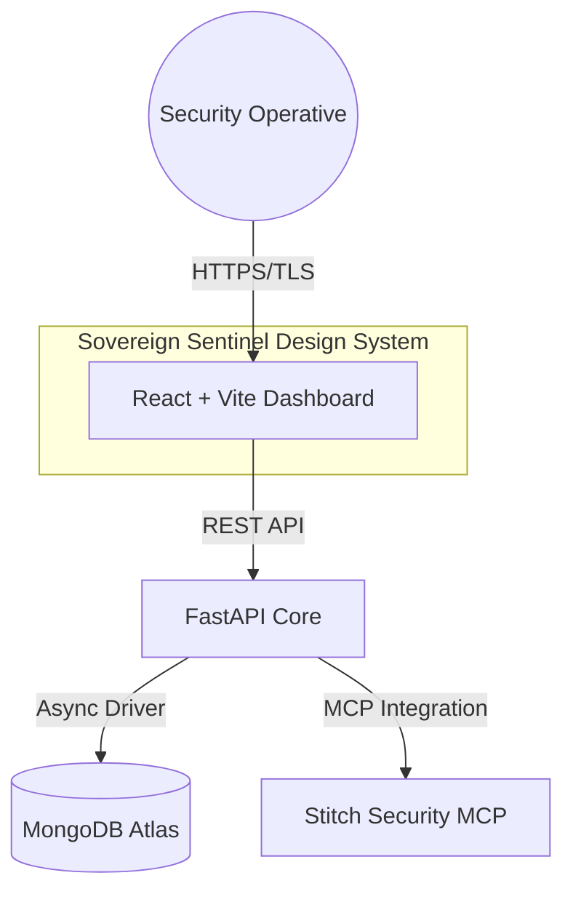

# 🛡️ Sentinel Prime

[](https://fastapi.tiangolo.com/)
[](https://reactjs.org/)
[](https://www.mongodb.com/)
[](https://tailwindcss.com/)
[](https://opensource.org/licenses/MIT)

**Sentinel Prime** is an enterprise-grade Vulnerability Management & Remediation platform. Built for high-trust security operations, it provides a fortified, high-density interface for security operatives to monitor infrastructure health, track CVEs, and orchestrate rapid remediation flows through an intelligent, glassmorphic design system.

---

## 🌌 Core Capabilities

Sentinel Prime transcends traditional security dashboards by unifying visibility and action:

- 🔒 **Fortified Authentication**: Military-grade JWT implementation with salted Bcrypt password hashing and session management.
- 📡 **Autonomous Scanning**: Deep-tissue inspection of repository configurations, dependency trees, and CI/CD pipelines.
- 📊 **Real-Time Health Scoring**: Proprietary algorithm that calculates infrastructure risk based on CVE severity, exposure surface, and asset criticality.
- 🛠️ **Intelligent Remediation**: Automated fix suggestions that generate precise code patches for detected vulnerabilities.
- 🌪️ **Sovereign Sentinel UI**: A bespoke design language featuring glassmorphism, dynamic tonal layering, and ultra-high-density data visualization.

---

## 🏗️ System Architecture

The platform is architected for massive scalability and low-latency security operations.



### 🛰️ Backend Tier (`/backend`)
- **Core**: Python 3.13 utilizing FastAPI for high-performance asynchronous execution.
- **Data Persistence**: MongoDB with Motor for non-blocking I/O.
- **Identity**: OAuth2 with JWT (JSON Web Tokens) for stateless authentication.
- **Validation**: Strict Pydantic v2 schemas for all request/response models.

### 🎨 Frontend Tier (`/frontend`)
- **Engine**: React 18 powered by Vite for instant HMR and optimized production builds.
- **Design Logic**: Custom Tailwind CSS configuration utilizing HSL variable tokens for dynamic "Dark Mode" layering.
- **State Management**: React Hooks + Context API for efficient cross-component data flow.
- **Navigation**: React Router v7 with protected route guards.

---

## 🚀 Deployment & Installation

### Infrastructure Requirements
- **Runtime**: Python 3.10+ & Node.js 18+
- **Persistence**: MongoDB 6.0+ (Atlas recommended)
- **Memory**: 512MB RAM minimum for backend core.

### 1. Initialize Backend Core
```bash
cd backend
python -m venv venv
source venv/bin/activate  # On Windows: .\venv\Scripts\activate
pip install -r requirements.txt
python main.py
```

### 2. Launch Interface
```bash
cd frontend
npm install
npm run dev
```

### 3. Environment Configuration
Configure your `.env` file in the project root:
```env
# Database Configuration
MONGO_URI=mongodb+srv://<user>:<password>@cluster0.example.net/sentinel_db

# Security Configuration
SECRET_KEY=your_64_character_hex_key
ALGORITHM=HS256
```

---

## 🛡️ Security Philosophy

Sentinel Prime operates on the principle of **"Zero Trust Visibility"**. Every metric displayed is cross-referenced against multiple security standards (NVD, GitHub Advisories, and internal policy engines) to ensure operatives are acting on the most accurate intelligence available.

### Data Privacy
- No plain-text secrets are stored in the database.
- Sensitive environment variables are masked in the UI.
- API endpoints are protected by CORS policies and Bearer Token validation.

---

## 🗺️ Roadmap & Evolution

- [ ] **Phase 1**: Initial release with manual scan triggers (Current).
- [ ] **Phase 2**: Real-time webhook integration for GitHub/GitLab.
- [ ] **Phase 3**: AI-driven "Auto-Patch" engine for automated pull requests.
- [ ] **Phase 4**: Multi-tenant RBAC (Role-Based Access Control) for large security teams.

---

## ⚖️ License

Distributed under the MIT License. See `LICENSE` for more information.

---

Developed with ⚡ by the **Sovereign Sentinel Team** for high-trust security operations.
